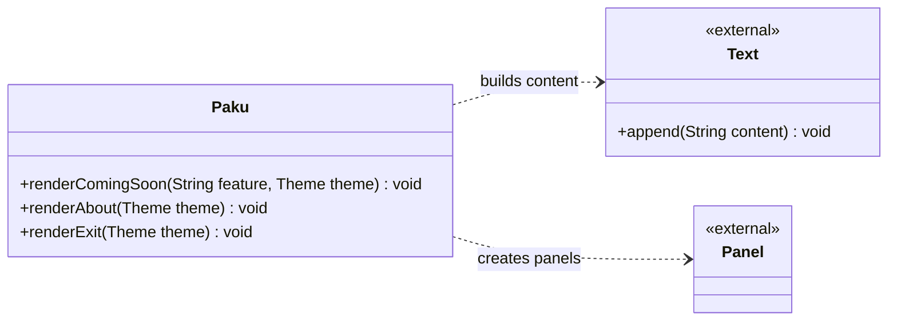

# Paku 🌸


[]
[]
[](LICENSE)

> Your tiny terminal companion.
## Table of Contents

- [Features](#features)
- [Phase 1 — Foundation](#phase-1--foundation)
- [Quick Start](#quick-start)
- [Requirements](#requirements)
- [Project Structure](#project-structure)
- [Replacing the Mascot](#replacing-the-mascot)
- [Themes](#themes)
- [Building the .exe](#building-the-exe)
- [Roadmap](#roadmap)
- [Releases](#releases)
- [Author](#author)
- [License](#license)

## Features

### System & Workspace


- `paku doctor` — Run read-only environment and system diagnostics.
- `paku info` — Display system and environment overview.
- `paku workspace` — Analyze current workspace and Git repository status.

### Cleanup & Session

- `paku clean` — Scan and safely clean temporary build/cache files under CWD.
- `paku save` / `paku resume` — Capture a snapshot of the current workspace memory and notes, then view saved workspace session memory and previous notes.

### Security

- `paku scan` — Run lightweight system hygiene & protection checks.
- `paku autoruns` — Enumerate Windows auto-start locations (read-only).
- `paku debloat` — Remove known Windows bloatware UWP apps.

### Customization

- `paku theme` — Browse and select a Paku colour theme.
- `paku settings` — Manage application preferences.

### Under the Hood

- **Zero-Blocking UI:** Smooth, concurrent animations that never choke your CPU.
- **Lightweight OS Calls:** Direct Windows API reads (`winreg`) instead of heavy PowerShell processes.

## Phase 1 — Foundation

Paku is a Windows-first CLI tool written in Python. It also imports and runs safely on non-Windows systems, with Windows-specific features showing a clear platform message.

It is designed to be packaged as a standalone `.exe` via PyInstaller.

## Quick Start

### For Users

Download the latest `.exe` from the [Releases](#releases) page and run it directly. No Python installation is needed.

### For Developers

Install the package in editable mode:

```powershell
pip install -e .
```

> **Note:** If Windows throws a PATH warning and the `paku` command is not recognized, you can always run the app reliably using `python -m paku`.

Then run Paku:

```powershell
# Interactive interface
paku

# Or via Python module
python -m paku

# Version
paku --version

# Help
paku --help

# Theme selector
paku theme
```

## Requirements

- Python 3.11+
- `typer>=0.12`
- `rich>=13`

## Project Structure

```text
paku/
├── src/paku/
│   ├── __init__.py
│   ├── __main__.py
│   ├── main.py
│   ├── cli.py
│   ├── config/
│   │   ├── __init__.py
│   │   └── settings.py
│   ├── data/
│   ├── features/
│   │   ├── __init__.py
│   │   ├── autoruns.py
│   │   ├── clean.py
│   │   ├── debloat.py
│   │   ├── doctor.py
│   │   ├── info.py
│   │   ├── resume.py
│   │   ├── scan.py
│   │   ├── settings.py
│   │   └── workspace.py
│   └── ui/
│       ├── __init__.py
│       ├── animations.py
│       ├── mascot.py
│       ├── terminal.py
│       └── themes.py
│   └── assets/
│       └── ascii/
│           ├── error.txt
│           ├── happy.txt
│           ├── idle.txt
│           ├── success.txt
│           ├── thinking.txt
│           └── working.txt
├── tests/
├── pyproject.toml
└── README.md
```


     ## Architecture



## Replacing the Mascot

Drop your finished ASCII `.txt` files into `src/paku/assets/ascii/`. The system reads them verbatim, preserving spaces, indentation, and alignment exactly.

## Themes

Edit `src/paku/ui/themes.py` to add or modify themes. Config is saved to `%APPDATA%\Paku\config.json`.

## Building the .exe

```powershell
pip install pyinstaller
pyinstaller --clean --noconfirm paku.spec
```

The spec file includes `assets/` so the mascot artwork is available in the
standalone executable.

## Roadmap

- Expand cross-platform diagnostics beyond the current Windows-first feature set.
- Add richer package and startup-entry details while keeping destructive actions explicit.
- Improve automated test coverage for platform-specific behavior.

## Releases

Download packaged Windows executables from the project's [Releases](https://github.com/rymrimi777-rgb/paku-terminal-companion/releases) page.

## Author

Created by Rym.

## License

This project is licensed under the MIT License — see [LICENSE](LICENSE) for details.
